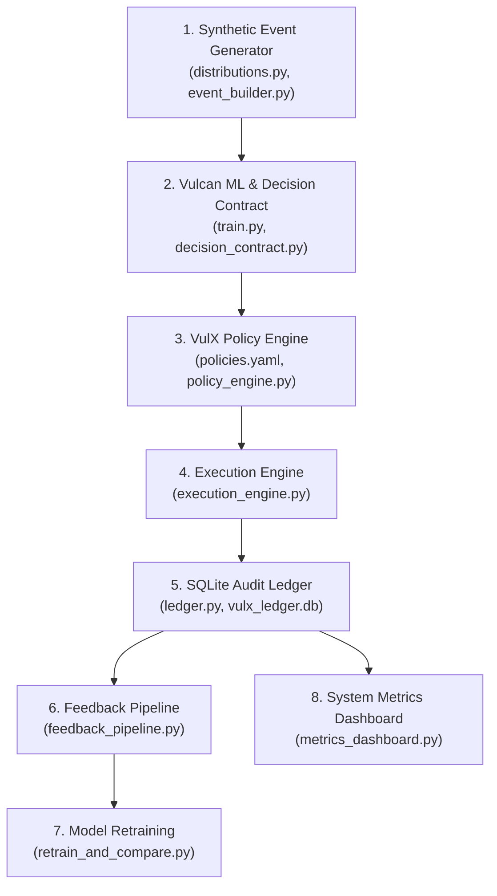

# VulX System Architecture

VulX is an end-to-end, policy-governed payment fraud detection and routing platform. It connects synthetic data generation, machine learning explainability, policy-as-code evaluation, step-up verification execution, persistent SQLite auditing, continuous feedback loops, and automated model retraining.

---

## End-to-End Pipeline Diagram

---

## Stage-by-Stage Technical Specifications

### Stage 1: Synthetic Event Generator (`src/vulx/generator/`)
Generates realistic payment transaction datasets with correlated fraud risk signals, 6 statistical category distributions (`normal`, `suspicious`, `borderline`, `fraud`, `legitimate_but_unusual`, `merchant_anomaly`), log-normal payment amount distributions, and fixed showcase test vectors (`demo_cases.json`). It provides reproducible ground-truth labels for model training and systematic policy benchmarking.

### Stage 2: Vulcan ML Model & Standard Decision Contract (`src/vulx/models/`)
Trains a primary XGBoost classifier alongside a 5-model bootstrap ensemble to compute standard decision contracts for incoming transactions. Each contract outputs a calibrated `risk_probability`, a `prediction_uncertainty` measure (`std_dev` across bootstrap models), top 3 SHAP feature contributions (`top_contributing_signals`), and a `naive_recommended_action` (`ALLOW`, `REVIEW`, `BLOCK`).

### Stage 3: VulX Policy Engine (`src/vulx/policy_engine.py` & `policies.yaml`)
Evaluates decision contracts against human-readable, editable policy-as-code rules defined in `policies.yaml`. It executes six sequential checks (purpose constraints for cross-merchant signals, severity tier mapping, customer tenure false-positive cost lookup, action reversibility check, model uncertainty mapping, and top-to-bottom decision table rules) to produce final routing decisions (`ALLOW`, `VERIFY`, `HUMAN_REVIEW`) with complete, human-readable rationale traces.

### Stage 4: Execution Engine (`src/vulx/execution_engine.py`)
Executes policy routing decisions in real time. Transactions routed to `ALLOW` complete immediately. Transactions routed to `VERIFY` simulate step-up customer authentication (e.g. 2FA or biometric challenge); successful verification completes the transaction and saves legitimate sales, while failed verification blocks fraud. Transactions routed to `HUMAN_REVIEW` support live analyst overrides or automated risk-threshold heuristics.

### Stage 5: SQLite Audit Ledger (`src/vulx/ledger.py`)
Persists immutable, structured audit records for every processed transaction into SQLite (`vulx_ledger.db`). It automatically computes correctness metrics (`TP`, `FP`, `TN`, `FN`), legal compliance tags (`cross_merchant_derived` vs `own_history` based on signal provenance), and financial retention classes (`financial_record_required` for completed payments vs `short_term_ops`).

### Stage 6: Continuous Feedback Pipeline (`feedback_pipeline.py`)
Queries the SQLite audit ledger to isolate false positive (`FP`) and false negative (`FN`) outcomes. For each misclassified case, it reconstructs the original feature vector paired with the verified ground-truth label, producing an incremental correction dataset (`correction_increment.csv`) that captures edge cases isolated by the `VERIFY` and `HUMAN_REVIEW` execution paths.

### Stage 7: Model Retraining & Comparison (`retrain_and_compare.py`)
Retrains the XGBoost classifier on the original training set augmented with the feedback correction dataset. It evaluates the updated model on the exact same held-out test set used originally and outputs a side-by-side comparison matrix (Precision, Recall, F1, False Positive Rate) to verify honest, empirical model improvement over time.

### Stage 8: System Metrics Dashboard (`metrics_dashboard.py`)
Queries the SQLite ledger to compute system-wide routing distributions (`% ALLOW`, `% VERIFY`, `% HUMAN_REVIEW`), step-up verification false-positive recovery rates, analyst exception list metrics, and side-by-side performance metrics comparing the full VulX-governed system against the raw ML model baseline.
