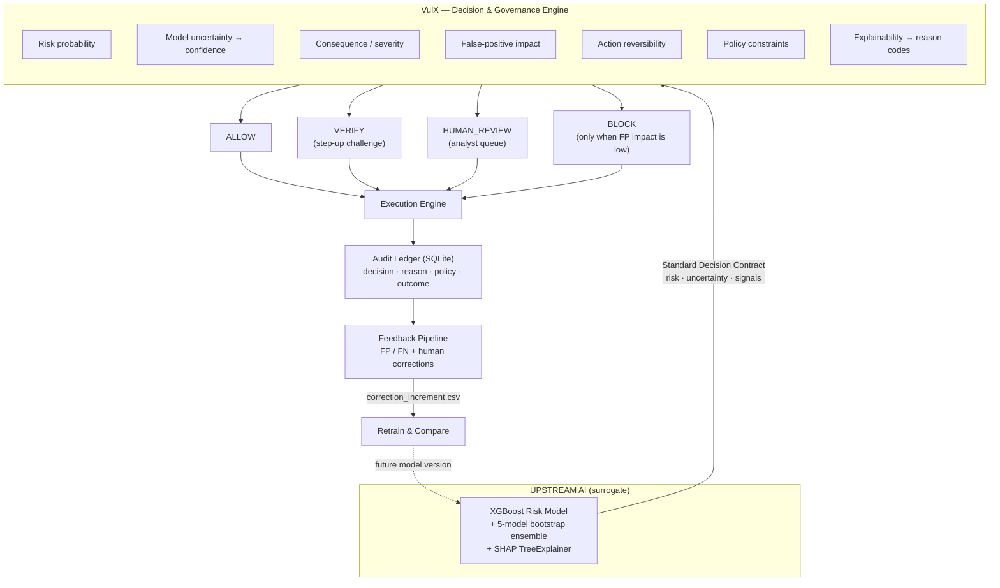

# VulX

**A Decision & Governance Engine that sits between an AI model's prediction and the real-world action taken from that prediction.**

> An AI risk model tells you *what it thinks*. VulX decides *what should actually happen* — and leaves an auditable record of why.

VulX takes an upstream risk prediction (probability, uncertainty, explanation) and evaluates it against decision-context factors — severity, false-positive impact, action reversibility, and policy constraints — before routing the transaction to `ALLOW`, `VERIFY`, or `HUMAN_REVIEW`.

**Vulcan provides intelligence. VulX governs how that intelligence becomes action.**

---

## Table of Contents

| | | |
|---|---|---|
| [Demo](#demo) | [The Problem](#the-problem) | [The Idea — VulX](#the-idea--vulx) |
| [How VulX Works](#how-vulx-works) | [Architecture](#architecture) | [End-to-End Example](#end-to-end-example) |
| [ML & Uncertainty](#ml--uncertainty) | [Governance Engine](#governance-engine) | [Explainability](#explainability) |
| [Audit Ledger](#audit-ledger) | [Feedback Loop](#feedback-loop) | [Real vs Simulated](#real-vs-simulated) |
| [Tech Stack](#tech-stack) | [Project Structure](#project-structure) | [Running the Project](#running-the-project) |
| [Example Output](#example-output) | [Why This Matters for Vulcan](#why-this-matters-for-vulcan) | [Limitations](#limitations) |
| [Future Scope](#future-scope) | [Disclaimer](#disclaimer) | |

---

## Demo

<!-- Replace the placeholders below with real captures from your run -->

| View | Screenshot |
| :--- | :--- |
| Live pipeline trace (`dashboard.py` → Tab 1) | `docs/img/live-run.png` *(placeholder)* |
| Naive model vs. governed system (Tab 2) | `docs/img/compare.png` *(placeholder)* |
| Audit ledger explorer (Tab 3) | `docs/img/ledger.png` *(placeholder)* |
| Policy lab — edit thresholds live (Tab 4) | `docs/img/policy-lab.png` *(placeholder)* |

```bash
pip install -r requirements.txt
python run_pipeline.py          # full 4-phase CLI trace
streamlit run dashboard.py      # interactive 5-tab dashboard
```

---

## The Problem

### In plain English

A fraud model looks at a payment and says: **"91% likely fraud."**

Most systems treat that number as an instruction. Score crosses a threshold → block the payment.

But a probability is not a decision. Consider a real scenario:

> A customer of two years, ₹45,000 purchase, travelling, on a new phone.
> Every risk signal the model watches lights up: new device, elevated velocity, unusual location.
> The model returns a high fraud score. The naive system blocks the payment.

The model was not wrong to be suspicious. The **system** was wrong to act that way. Blocking cost a real, loyal customer their purchase — and cost the business the revenue plus the support ticket plus the trust.

### Why it matters

Confidence alone doesn't tell you whether an automated action is appropriate. A complete decision needs answers to questions a model does not answer:

| Question the model doesn't answer | Why it changes the action |
| :--- | :--- |
| How uncertain is this prediction? | A model that internally disagrees with itself is a poor basis for a hard block. |
| How costly is a wrong block here? | Blocking a 2-year customer's ₹45,000 payment is not the same as blocking a day-old account's ₹200 payment. |
| How severe is the transaction? | Amount and impact scale the cost of *both* error directions. |
| Is the proposed action reversible? | A step-up challenge can be undone. A permanent suspension cannot. |
| Does policy permit automatic action here? | Some signals (e.g. cross-merchant-derived data) may not be a lawful basis for a silent auto-block. |
| Is there a softer action available? | "Ask the customer to verify" is often strictly better than allow-or-block. |
| Who is accountable if this is wrong? | If nothing is recorded, nobody can answer that later. |

### The core architectural gap

```
Naive:     Prediction ──────────────────────────────► Action
VulX:      Prediction ──► Decision (governed) ──────► Action ──► Audit ──► Feedback
```

Most ML systems collapse *prediction* and *action* into one step. VulX separates them and makes the middle step explicit, configurable, and reviewable.

---

## The Idea — VulX

VulX is a **Decision & Governance Engine**. It consumes a structured prediction from an upstream AI model and evaluates it against seven decision-context factors:

| Factor | What it captures |
| :--- | :--- |
| **Risk probability** | The upstream model's score. |
| **Model uncertainty** | How much the model's own variants disagree on this case. |
| **Consequence / severity** | How impactful this specific transaction is. |
| **False-positive impact** | How damaging it would be to wrongly block *this* customer. |
| **Reversibility** | Whether the proposed action can be undone. |
| **Policy constraints** | Hard rules that override score-based logic. |
| **Explainability** | Which signals drove the score, used to produce a human-readable reason. |

Instead of `AI → BLOCK`, VulX routes to a **graded action**:

| Route | Meaning | When it fits |
| :--- | :--- | :--- |
| `ALLOW` | Complete the payment. | Low risk, clean profile. |
| `VERIFY` | Challenge the customer (step-up / 2FA), then decide on the result. | Genuine suspicion, but a wrong block would be expensive — let the customer resolve it. |
| `HUMAN_REVIEW` | Queue for an analyst, record their decision. | High stakes, irreversible action, or the model is confidently high-risk on a high-value customer. |
| `BLOCK` | Hard decline. | High risk **and** low false-positive impact. Reachable, but never the default for high-FP-impact cases. |

**The goal is not a more accurate model.** The goal is AI-driven actions that are controlled, explainable, consequence-aware, and auditable.

### Terminology: "False Positive" vs. "False-Positive Impact"

These are different things and are easy to confuse. This distinction is central to the architecture:

| Term | What it is | When it is known | Where it lives |

| :--- | :--- | :--- | :--- |
| **False Positive** | The model predicted fraud, but the transaction was actually legitimate. A *statistical model metric*. | **After** the fact — requires ground truth. | `metrics.json`, ledger `correctness` column |

| **False-Positive Impact / Cost** | A **pre-decision estimate** of how damaging it would be *if* the system incorrectly blocked this legitimate transaction. A *governance input*. | **Before** acting — computed from context. | `policies.yaml → false_positive_cost_table` |

In this prototype, false-positive impact is derived from customer tenure × transaction severity:

```
Long-term customer (>365 days)  +  High-value transaction (>₹10,000)  =  fp_cost: HIGH
New account (≤30 days)          +  Medium-value transaction          =  fp_cost: LOW
```

A `high` fp_cost does **not** mean "the model is probably wrong." It means "if the model *is* wrong here, it will hurt a lot — so do not take an unrecoverable action on this score alone."

---

## How VulX Works

```
Synthetic Transaction Data        Stand-in for a real payment stream
          ↓
   XGBoost Risk Model             Surrogate for an upstream AI intelligence layer
          ↓
   Risk Probability               "How risky does the model think this is?"
          ↓
  Bootstrap Ensemble              5 models trained on resampled data
          ↓
  Uncertainty Estimate            "How much do those models disagree?"
          ↓
  SHAP Explainability             "Which signals drove this score?"
          ↓
  VulX Governance Engine          "Given all of the above — what should we DO?"
          ↓
 ALLOW / VERIFY / HUMAN_REVIEW    Graded, reversible-first action
          ↓
     Audit Ledger                 Every decision, reason, and outcome recorded
          ↓
    Feedback Loop                 Corrections become structured training signal
```

**Component purposes:**

| Stage | Purpose | Implementation |
| :--- | :--- | :--- |
| Synthetic data | Provide labelled transactions with realistic signal correlations, since no production data is available. | `src/vulx/generator/` |
| XGBoost model | Produce a risk probability — the upstream "intelligence" this project governs. | `src/vulx/models/train.py` |
| Bootstrap ensemble | Estimate predictive uncertainty from model disagreement. | `models/model_ensemble/model_0..4.pkl` |
| SHAP | Attribute the score to specific features, so the decision can carry a reason. | `src/vulx/models/decision_contract.py` |
| Governance engine | Combine risk + uncertainty + context + policy into a routed action. | `src/vulx/policy_engine.py` + `policies.yaml` |
| Execution engine | Carry out the routed action (step-up challenge, analyst review) and report the outcome. | `src/vulx/execution_engine.py` |
| Ledger | Persist the full decision record for audit and compliance. | `src/vulx/ledger.py` (SQLite) |
| Feedback | Turn confirmed errors and human corrections into a retraining increment. | `feedback_pipeline.py`, `retrain_and_compare.py` |

### The Standard Decision Contract

The interface between the model layer and the governance layer is a single JSON object. This is deliberate: **VulX doesn't care what produced the prediction.** Swap XGBoost for any other model — or in principle for an upstream system like Vulcan — and the governance layer is unchanged as long as the contract is honoured.

```json
{
  "transaction_id": "demo_fp_001_showcase",
  "amount": 45000.0,
  "customer_tenure_days": 400,
  "risk_probability": 0.7818,
  "prediction_uncertainty": { "std_dev": 0.2242, "uncertainty_level": "high" },
  "top_contributing_signals": [
    { "feature": "ip_reputation_score", "contribution": 1.4671, "tags": ["cross_merchant_derived"] },
    { "feature": "device_novelty",      "contribution": 1.3114, "tags": [] },
    { "feature": "location_deviation",  "contribution": 0.7509, "tags": [] }
  ],
  "naive_recommended_action": "BLOCK"
}
```

`naive_recommended_action` is the **baseline VulX is measured against** — what a threshold-only system would have done (`>0.70 → BLOCK`, `<0.30 → ALLOW`, else `REVIEW`). It is an input to the governance layer, not an instruction.

---

## Architecture



<details>
<summary>Same architecture, plain-text version</summary>

```
                 UPSTREAM AI
          ┌─────────────────────┐
          │ XGBoost Surrogate   │
          │ "Vulcan-like" model │
          └──────────┬──────────┘
                     │
             Risk Prediction
             + Uncertainty
             + SHAP Signals
                     │
                     ▼
          ┌─────────────────────┐
          │       VulX          │
          │ Decision &          │
          │ Governance Engine   │
          ├─────────────────────┤
          │ Risk                │
          │ Uncertainty         │
          │ Consequence         │
          │ FP Impact           │
          │ Reversibility       │
          │ Policy              │
          │ Explainability      │
          └──────────┬──────────┘
                     │
          ┌──────────┼──────────┐
          ▼          ▼          ▼
       ALLOW       VERIFY    HUMAN REVIEW
          │          │          │
          └──────────┼──────────┘
                     ▼
              Audit / Ledger
                     │
                     ▼
              Feedback Loop
```

</details>

---

## End-to-End Example

This is the prototype's showcase case (`demo_fp_001_showcase`), and the numbers below are the **actual output** of `python run_pipeline.py`, not an illustration.

**The transaction**

| Field | Value |
| :--- | :--- |
| Amount | ₹45,000 |
| Customer tenure | 400 days |
| Device novelty | 0.95 (new device) |
| Transaction velocity | 4 in the last hour |
| Location deviation | 0.88 (far from usual) |
| Merchant history score | 0.05 (clean merchant) |
| Ground truth | **legitimate** |

**Step 1 — XGBoost model**

```
risk_probability = 0.7818   →   naive_recommended_action = BLOCK
```

A threshold-only system stops here and declines a legitimate ₹45,000 payment from a 400-day customer.

**Step 2 — Bootstrap ensemble**

```
std_dev across 5 models = 0.2242   →   uncertainty_level = high
```

The five surrogate models disagree substantially. This is not a case the model is united on.

**Step 3 — SHAP**

```
ip_reputation_score  +1.467   ← tagged cross_merchant_derived
device_novelty       +1.311
location_deviation   +0.751
```

Note the top driver carries a policy tag — it is a cross-merchant-derived signal, which the prototype's policy treats as insufficient grounds for a silent auto-block.

**Step 4 — VulX governance**

| Factor | Value | Derivation |
| :--- | :--- | :--- |
| Severity | `high` | ₹45,000 > ₹10,000 medium ceiling |
| False-positive impact | `high` | long tenure (400 d > 365) × high severity |
| Confidence | `low` | high uncertainty × moderate distance from 0.5 |
| Reversibility | `reversible` | step-up verification path available |
| Purpose constraint | `triggered` | `ip_reputation_score` is `cross_merchant_derived` |

Matching rule: **"High FP cost VIP protection"** → `fp_cost == 'high' and is_reversible and confidence != 'high'`

**Final decision: `VERIFY`**

> `final: VERIFY because high FP cost VIP customer requires step-up 2FA to prevent false positive block`

**Step 5 — Execution & audit**

```
Action taken:      VERIFY  →  step-up challenge  →  VERIFIED
Final outcome:     completed
Ledger correctness: TN  (false positive prevented — legitimate payment saved)
Legal basis tag:    cross_merchant_derived
Retention class:    financial_record_required
```

### What just happened

The underlying model considered this transaction high risk — and it was not being unreasonable, since every behavioural signal was genuinely anomalous. But VulX determined that **blindly blocking it would create significant customer and business impact**, that the model was **internally uncertain**, and that a **reversible alternative existed**. So it required an additional verification step instead.

The customer completed a 2FA challenge and their payment went through.

> **The model predicts. VulX decides how that prediction should be acted upon.**

### The control case

The prototype includes a deliberate near-twin, `demo_fraud_001_counterpart` — ₹48,000, device novelty 0.96, velocity 5, but **12-day tenure** and **IP reputation 0.15**. Same surface pattern; different context.

| | Showcase FP | Fraud counterpart |
| :--- | :--- | :--- |
| Amount | ₹45,000 | ₹48,000 |
| Tenure | 400 days | 12 days |
| IP reputation | 0.60 | 0.15 |
| Risk probability | 0.7818 | 0.9678 |
| FP impact | `high` | `low` |
| **VulX route** | **`VERIFY`** | **`BLOCK`** |
| Ground truth | legitimate | fraud |

This matters: VulX is not a "be nicer to high-value customers" heuristic. Given low false-positive impact and high risk, it blocks — automatically and immediately.

---

## ML & Uncertainty

### The model

| Property | Value |
| :--- | :--- |
| Type | `XGBClassifier` (gradient-boosted trees) |
| Hyperparameters | `n_estimators=100`, `max_depth=4`, `learning_rate=0.1`, `eval_metric=logloss`, `random_state=42` |
| Dataset | 2,000 synthetic events, 80/20 stratified split (1,600 train / 400 test) |
| Features | 11 (7 numeric + 4 one-hot payment methods) |
| Artifact | `models/model.pkl` |

**Held-out test metrics** (`models/metrics.json`):

| Metric | Score |
| :--- | :--- |
| Precision | 0.7284 |
| Recall | 0.8551 |
| F1 | 0.7867 |
| AUC-ROC | 0.9711 |

```
                     Predicted Legitimate    Predicted Fraud
Actual Legitimate            309 (TN)               22 (FP)
Actual Fraud                  10 (FN)               59 (TP)
```

Those 22 false positives are exactly the population VulX exists to handle differently. A model with 0.73 precision on a synthetic set is not the point — the point is that **any** model with imperfect precision needs a governance layer, and a deliberately imperfect one makes that visible.

### Uncertainty via bootstrap ensemble

Because the actual Vulcan model is unavailable, the prototype trains **5 additional XGBoost models on bootstrap-resampled training data** (`sklearn.utils.resample`, seeds 52/62/72/82/92) and measures how much they disagree on the same transaction.

```
Same transaction, five surrogate models:

  Model 1 → 0.91
  Model 2 → 0.89
  Model 3 → 0.93      σ ≈ 0.014  →  uncertainty_level = low
  Model 4 → 0.90                    (the models agree)
  Model 5 → 0.92
```

The spread (standard deviation) becomes the uncertainty proxy:

| σ across ensemble | `uncertainty_level` |
| :--- | :--- |
| < 0.05 | `low` |
| 0.05 – 0.15 | `medium` |
| ≥ 0.15 | `high` |

> **Precise wording:** *VulX estimates predictive uncertainty from disagreement among bootstrap-trained surrogate models.*
>
> This is a frequentist epistemic-uncertainty proxy measuring data-sampling variance. It is **not** a Bayesian posterior, and it makes **no claim** about how Vulcan — or any production system — internally computes confidence. It is one defensible way to obtain an uncertainty signal when you control the model; the governance layer only requires *some* uncertainty input, not this specific one.

### Uncertainty → confidence

Raw σ is combined with how far the score sits from the 0.5 decision boundary, via a matrix in `policies.yaml`:

| uncertainty ↓ / distance from 0.5 → | high (≥0.35) | medium (≥0.15) | low |
| :--- | :--- | :--- | :--- |
| **low** | high | high | medium |
| **medium** | medium | medium | low |
| **high** | medium | low | low |

A score of 0.78 with high ensemble disagreement lands on `confidence: low` — which is precisely why the showcase case is not auto-blocked.

---

## Governance Engine

The engine (`src/vulx/policy_engine.py`) runs six ordered checks over the decision contract, then evaluates a top-to-bottom routing table.

| # | Check | Output |
| :--- | :--- | :--- |
| 1 | **Purpose constraint** — are any top SHAP signals tagged `cross_merchant_derived`? | `purpose_constraint_triggered` |
| 2 | **Severity tiers** — amount vs. configured ceilings (₹1,000 / ₹10,000) | `severity: low\|medium\|high` |
| 3 | **False-positive impact** — tenure bucket × severity lookup | `fp_cost: low\|medium\|high` |
| 4 | **Reversibility** — is the proposed action in the irreversible list? | `is_reversible` |
| 5 | **Uncertainty → confidence** — σ × distance-from-0.5 matrix | `confidence: low\|medium\|high` |
| 6 | **Routing table** — first matching rule wins | `routing_decision` + rationale |

### Policy-as-code

All thresholds, matrices, and rules live in **`policies.yaml`** — editable without touching Python. The Policy Lab tab of the dashboard lets a reviewer change them and watch decisions move in real time.

```yaml
severity_tiers:
  low_max: 1000.0
  medium_max: 10000.0

false_positive_cost_table:
  tenure_buckets: { short_max_days: 30, medium_max_days: 365 }
  matrix:
    long:   { high: high,   medium: medium, low: low }
    medium: { high: medium, medium: medium, low: low }
    short:  { high: medium, medium: low,    low: low }

routing_rules:
  - name: "Rule 1: High FP cost VIP protection"
    condition: "fp_cost == 'high' and is_reversible and confidence != 'high'"
    decision: "VERIFY"
    rationale: "final: VERIFY because high FP cost VIP customer requires step-up 2FA..."
```

### The routing table

Rules are evaluated in order; the first match decides.

| # | Rule | Condition | → |
| :--- | :--- | :--- | :--- |
| 1 | High FP-cost protection | `fp_cost == high` and reversible and confidence ≠ high | `VERIFY` |
| 2 | Automated high-risk block | naive action is `BLOCK` and `fp_cost != high` | `BLOCK` |
| 3 | High FP-cost, high confidence | `fp_cost == high` and confidence `high` and naive `BLOCK` | `HUMAN_REVIEW` |
| 4 | Purpose constraint floor | constraint triggered and naive action is `ALLOW` | `VERIFY` |
| 5 | Borderline risk | naive `REVIEW`, or 0.35 ≤ risk < 0.70 | `VERIFY` |
| 6 | Irreversible-action safety | not reversible | `HUMAN_REVIEW` |
| 7 | Default | always true | `ALLOW` |

Note the design intent visible in the ordering: **high false-positive impact is checked before the model's own recommendation.** Rule 1 fires before Rule 2 can block, so a high-FP-impact case can never be silently auto-blocked while a reversible alternative exists. Rule 3 is the escalation path — when the model is *confidently* high-risk on a high-value customer, that is not a case for either an automatic block or an automatic challenge; it goes to a human.

> **These are demonstration policies.** The thresholds (₹1,000 / ₹10,000, 30 / 365 days, σ 0.05 / 0.15, the FP-cost matrix, all seven rules) were chosen by the author to exercise the architecture on synthetic data. They are **not** Razorpay's production policies, and this project has no knowledge of what those are.

---

## Explainability

`decision_contract.py` runs `shap.TreeExplainer` on the trained XGBoost model and extracts the **top 3 features by absolute contribution** for each individual transaction:

```
Risk Score: 78.2%

Top contributing signals:
  + ip_reputation_score   +1.467   [cross_merchant_derived]
  + device_novelty        +1.311
  + location_deviation    +0.751
```

These signals serve three governance purposes, not just display:

1. **Reason codes** — the decision carries a human-readable explanation of *why*, which is what an analyst or a customer-support agent actually needs.
2. **Policy triggers** — features carry **tags**. Any signal tagged `cross_merchant_derived` (here: `merchant_history_score`, `ip_reputation_score`) trips the purpose-constraint check, which enforces a minimum action of `VERIFY` and disallows `BLOCK`. This is the mechanism by which *"what kind of data drove this score"* can constrain *"what we are allowed to do about it."*
3. **Audit legal basis** — the ledger stamps `legal_basis_tag` from these tags, so every stored decision records what class of data justified it.

**Performance note:** SHAP is computed on a **decoupled path**. `get_fast_decision()` returns risk + uncertainty + naive action without SHAP; `get_explanation()` computes attributions separately. This keeps explainability out of the latency-critical path — a real payment gateway cannot afford to block on it.

> These are synthetic prototype features (`device_novelty`, `location_deviation`, `merchant_history_score`, …) defined by this project's own generator in `docs/SCHEMA.md`. They are **not** Vulcan's internal features, and no claim is made about what Vulcan's feature schema contains.

---

## Audit Ledger

Every decision is written to SQLite (`data/processed/vulx_ledger.db`, table `ledger_events`) — one row per governed transaction, capturing the whole chain:

| Column | Content |
| :--- | :--- |
| `event_id`, `transaction_id`, `timestamp` | Identity |
| `risk_probability` | What the model predicted |
| `naive_recommended_action` | What a threshold-only system would have done |
| `routing_decision` | What VulX decided |
| `rationale_trace` | Full JSON reasoning chain — every check, with its inputs and the rule that fired |
| `action_taken` | What was executed |
| `verification_outcome` | `VERIFIED` / `FAILED` / null |
| `human_review_outcome` | `APPROVED` / `REJECTED` / null — analyst override |
| `final_outcome` | `completed` / `blocked` |
| `ground_truth_label` | Truth, when available |
| `correctness` | `TP` / `FP` / `TN` / `FN`, derived from outcome × truth |
| `legal_basis_tag` | `own_history` / `cross_merchant_derived` |
| `retention_class` | `financial_record_required` / `short_term_ops` |

Because both `naive_recommended_action` and `routing_decision` are stored, the ledger answers the question that matters for evaluating a governance layer: **on which transactions did governance change the outcome, and was that change right?**

A stored `rationale_trace` looks like this:

```json
[
  "purpose_constraint=triggered because signal 'ip_reputation_score' is tagged as cross_merchant_derived (requires min VERIFY, disallows silent auto-BLOCK)",
  "severity=high because amount=45000.0 > 10000.0",
  "FP_cost=high because customer_tenure_days=400 (long-tenure, > 365d) and severity=high",
  "reversibility=reversible because naive_action=BLOCK is reversible (step-up verification path available)",
  "confidence=low because uncertainty_level=high (std_dev=0.2242) and distance_from_0.5=0.2818",
  "final: VERIFY because high FP cost VIP customer requires step-up 2FA to prevent false positive block"
]
```

Every decision is reconstructable after the fact, without re-running the model.

---

## Feedback Loop

```
AI prediction
      ↓
VulX decision            ← recorded with full reasoning
      ↓
Transaction outcome      ← step-up verified / failed, analyst approved / rejected
      ↓
Ground truth / human correction
      ↓
Feedback data            ← correction_increment.csv
      ↓
Future model improvement ← retrain & compare
```

**How it works in the prototype:**

1. `feedback_pipeline.py` queries the ledger for rows where `correctness` is `FP` or `FN`, joins them back to their original feature rows, and writes `data/processed/correction_increment.csv`. It also reports *which routing path* produced each correction — so you can see whether errors are escaping through `ALLOW`, surviving `VERIFY`, or slipping past `HUMAN_REVIEW`.
2. `retrain_and_compare.py` retrains XGBoost with the correction increment appended and prints a before/after comparison on the same held-out test set, so the effect of feedback is measured rather than assumed.

The interesting property is that **human corrections become structured data by construction**. When an analyst rejects or approves a `HUMAN_REVIEW` case in `human_review_cli.py`, that judgement is written as `human_review_outcome`, drives `final_outcome`, and therefore lands in the correction set automatically. Human review stops being a cost centre and becomes a labelling pipeline.

> This demonstrates the *mechanism* by which governed decisions and human corrections can become learning signal. It does not retrain, influence, or interact with Razorpay's Vulcan in any way.

---

## Real vs Simulated

This is the section to read before evaluating any claim in this repository.

### ✅ Real / public context

- Razorpay has **publicly introduced Vulcan**, described as a large-scale AI system for payment intelligence.
- Its internal model, training data, feature schema, prediction API, and production decision outputs are **not publicly available to this project**.
- Therefore this project makes **no claim** to reproduce, access, benchmark, or improve Vulcan.

### 🔬 Prototype / simulated

| Component | Status |
| :--- | :--- |
| Upstream AI model | **Surrogate.** XGBoost trained by this project, standing in for an upstream intelligence layer. |
| Transaction data | **Synthetic.** 2,000 events generated by `src/vulx/generator/`; schema and distributions documented in `docs/SCHEMA.md`. |
| Risk scores | **Generated by the prototype's own model.** |
| Ensemble uncertainty | **Estimated by the prototype** from bootstrap-model disagreement. |
| SHAP explanations | **Real SHAP**, computed on the prototype's XGBoost model — explaining the surrogate, not Vulcan. |
| Governance policies & thresholds | **Prototype policies** authored for this project. Not production policies. |
| Step-up verification | **Simulated.** `execution_engine.py` draws against a configurable success probability (default 0.85). No real 2FA/OTP integration. |
| Human review | **Real interactive CLI** (`human_review_cli.py`) with a deterministic heuristic fallback when no analyst is present. |
| Audit ledger | **Fully implemented** — real SQLite persistence and querying. |
| Feedback & retraining | **Fully implemented** — real ledger extraction and real XGBoost retraining on synthetic data. |

### What this project does *not* claim

- ❌ *"We reverse-engineered Vulcan."* — We did not. We have no access to it.
- ❌ *"XGBoost is Vulcan."* — It is not. It is a locally trained stand-in with 11 synthetic features.
- ❌ *"This improves Vulcan's accuracy."* — It does not touch Vulcan, and improving model accuracy is not the goal.
- ❌ *"These are Razorpay's fraud policies."* — They are demonstration policies written by the author.

### What it does claim

> **Because Vulcan is proprietary and inaccessible, VulX uses a synthetic XGBoost surrogate to demonstrate the governance architecture that could operate on top of an upstream AI decision engine such as Vulcan.**

The contribution is the **governance layer and its interface contract** — not the model underneath it.

---

## Tech Stack

| Layer | Technology |
| :--- | :--- |
| Model | XGBoost (`XGBClassifier`), scikit-learn (split, metrics, bootstrap resampling) |
| Explainability | SHAP (`TreeExplainer`) |
| Policy | YAML policy-as-code (`PyYAML`), ordered rule evaluation |
| Data | NumPy, pandas; custom synthetic generator |
| Persistence | SQLite (stdlib `sqlite3`) |
| UI | Streamlit + Plotly (5-tab dashboard), argparse CLIs |
| Testing | pytest (20 tests) |
| Packaging | `src/` layout, `pyproject.toml` / `setup.py` |
| Dev env | Dev Container (`.devcontainer/`) |

---

## Project Structure

```
.
├── policies.yaml                 # ★ Policy-as-code: thresholds, matrices, routing rules
│
├── src/vulx/
│   ├── config.py                 # Canonical paths & env-configurable settings
│   ├── policy_engine.py          # ★ Governance engine — 6 checks + routing table
│   ├── execution_engine.py       # Step-up verification / analyst review simulation
│   ├── ledger.py                 # SQLite audit ledger + correctness/compliance tagging
│   ├── models/
│   │   ├── train.py              # XGBoost training + 5-model bootstrap ensemble
│   │   ├── preprocessor.py       # 11-feature vector construction
│   │   └── decision_contract.py  # ★ Fast path (risk+uncertainty) & SHAP path
│   ├── generator/                # Synthetic event generation
│   │   ├── distributions.py      #   Per-category feature distributions
│   │   ├── event_builder.py      #   Dataset assembly
│   │   └── showcase.py           #   8 fixed demo vectors
│   └── utils/output_formatter.py
│
├── run_pipeline.py               # ★ End-to-end 4-phase CLI trace
├── dashboard.py                  # ★ Streamlit dashboard (5 tabs, live pipeline)
├── app.py                        # Lighter 3-tab Streamlit demo
├── human_review_cli.py           # Interactive analyst review console
├── feedback_pipeline.py          # FP/FN extraction → correction_increment.csv
├── retrain_and_compare.py        # Retrain with feedback + before/after comparison
├── metrics_dashboard.py          # System-wide routing & governed-vs-naive metrics
├── benchmark.py                  # Per-stage latency benchmark (p50/p95/p99)
│
├── scripts/
│   ├── generate_events.py        # CLI: generate synthetic dataset
│   ├── train_model.py            # CLI: train model + ensemble
│   └── decision_contract.py      # CLI: inspect a single decision contract
│
├── data/
│   ├── raw/events.csv            # 2,000 synthetic events
│   └── processed/
│       ├── demo_cases.json       # 8 reproducible showcase vectors
│       └── vulx_ledger.db        # SQLite audit ledger (generated, gitignored)
│
├── models/
│   ├── model.pkl                 # Primary XGBoost classifier
│   ├── metrics.json              # Held-out test metrics
│   └── model_ensemble/           # model_0..4.pkl — uncertainty ensemble
│
├── docs/
│   ├── SCHEMA.md                 # Synthetic dataset schema & distributions
│   └── MODEL_CARD.md             # Model card + honest uncertainty disclosure
│
├── tests/                        # 20 pytest tests
├── ARCHITECTURE.md               # Stage-by-stage technical architecture
├── WORKFLOW_AND_ARCHITECTURE.md  # Detailed workflow walkthrough
└── DEMO_SCRIPT.md                # Timed 5-minute demo walkthrough
```

---

## Running the Project

### Setup

```bash
git clone <repo-url> && cd vulx
pip install -r requirements.txt
```

Python 3.10 recommended (3.8+ supported). A Dev Container config is included if you prefer a preconfigured environment. Trained artifacts (`models/`, `data/`) are committed, so you can run the demos immediately without training.

### 1. End-to-end pipeline trace

```bash
python run_pipeline.py
```

Runs all 8 showcase vectors through model → governance → execution → ledger, with a step-by-step trace of the ₹45,000 showcase case and a summary table.

### 2. Interactive dashboard *(best for a first look)*

```bash
streamlit run dashboard.py
```

| Tab | Shows |
| :--- | :--- |
| Live Run | Real per-stage timings, SHAP contribution chart, full rationale trace |
| Compare: Naive vs VulX | Batch comparison; rows where governance changed the outcome are highlighted |
| Ledger Explorer | Live SQLite query, false-positives-prevented metric, human-review load |
| Policy Lab | Move thresholds with sliders and watch decisions change |
| Metrics & Retrain | `metrics.json`, `retrain_comparison.json`, `benchmark_results.json` |

A lighter 3-tab version is available via `streamlit run app.py`.

### 3. Governance engine showcase

```bash
python test_policy_engine.py
```

Walks the routing rules and demonstrates live YAML policy modification.

### 4. Analyst review console

```bash
python human_review_cli.py                    # first case needing review
python human_review_cli.py --demo_id <tx_id>  # a specific transaction
```

### 5. Feedback loop & retraining

```bash
python feedback_pipeline.py      # ledger FP/FN → correction_increment.csv
python retrain_and_compare.py    # retrain + before/after comparison
```

### 6. System metrics & latency

```bash
python metrics_dashboard.py      # routing distribution, governed vs naive
python benchmark.py              # per-stage p50/p95/p99 latency
```

### 7. Regenerate data & model from scratch

```bash
python scripts/generate_events.py --n_events 2000 --seed 42
python scripts/train_model.py
```

### 8. Tests

```bash
python -m pytest tests/ -q
# 20 passed
```

Run `pytest tests/` rather than a bare `pytest` — there are legacy top-level test files with basenames that collide with `tests/`, which breaks collection at the repository root.

---

## Example Output

Actual output of `python run_pipeline.py`:

```
-------------------------------------------------------------------------------------
 STEP-BY-STEP TRACE: ₹45,000 SHOWCASE FALSE POSITIVE TRANSACTION
-------------------------------------------------------------------------------------
  [1] ML Model says:          78.2% risk, Naive Action: BLOCK
                              Top signals: [ip_reputation_score (+1.467),
                                            device_novelty (+1.311),
                                            location_deviation (+0.751)]
  [2] VulX Governance Engine: Routed to VERIFY
                              Rationale: final: VERIFY because high FP cost VIP
                              customer requires step-up 2FA to prevent false
                              positive block
  [3] Execution Engine:       Action taken: VERIFY (VERIFIED)
                              Final Payment Outcome: COMPLETED
  [4] SQLite Ledger Record:   Audit Correctness: TN [Prevented False Positive]
                              Legal Basis Tag: cross_merchant_derived
                              Retention: financial_record_required
-------------------------------------------------------------------------------------

 SUMMARY TABLE ACROSS ALL 8 DEMO SHOWCASE CASES
Tx ID                  | Amount     | Naive Act | Policy Route | Outcome   | GT Label   | Correct
-------------------------------------------------------------------------------------------------
demo_fp_001_showcase   | INR 45,000 | BLOCK     | VERIFY       | completed | legitimate | TN
demo_fraud_001_counter | INR 48,000 | BLOCK     | BLOCK        | blocked   | fraud      | TP
demo_norm_001          | INR 350    | ALLOW     | VERIFY       | completed | legitimate | TN
demo_susp_001          | INR 12,500 | REVIEW    | VERIFY       | completed | fraud      | FN
demo_bord_001          | INR 2,100  | ALLOW     | VERIFY       | blocked   | legitimate | FP
demo_bord_002          | INR 1,800  | BLOCK     | BLOCK        | blocked   | fraud      | TP
demo_merch_001         | INR 7,500  | BLOCK     | BLOCK        | blocked   | fraud      | TP
demo_legit_unusual_002 | INR 1,200  | ALLOW     | VERIFY       | completed | legitimate | TN
```

**Reading this honestly:** governance is not free. Row 1 is the win — a naive `BLOCK` on a legitimate ₹45,000 payment became a `VERIFY` that completed. Row 4 is a genuine cost — a fraudulent ₹12,500 transaction was routed to `VERIFY`, passed the simulated step-up, and completed as an `FN`. Row 5 shows a step-up challenge failing on a legitimate transaction. Rows 3 and 8 show low-risk payments pulled into `VERIFY` by the purpose-constraint rule — added customer friction for policy reasons.

That trade-off is the substance of the project, not an embarrassment to be hidden: **governance shifts error from the expensive direction to the cheap direction, and adds friction doing so.** The `policies.yaml` thresholds are the dial that controls the exchange rate, which is exactly why they belong in a config file that a risk team can own.

### Latency (`benchmark_results.json`, 100 runs)

| Stage | p50 | p95 | p99 |
| :--- | :--- | :--- | :--- |
| Fast decision path (risk + uncertainty) | 33.8 ms | 53.5 ms | 81.7 ms |
| Governance engine | 25.3 ms | 33.0 ms | 42.2 ms |
| Execution + ledger write | 9.4 ms | 16.1 ms | 22.4 ms |
| SHAP explanation (decoupled) | 19.1 ms | 30.6 ms | 38.9 ms |
| **Total pipeline** | **87.7 ms** | **131.3 ms** | **158.4 ms** |

Measured on the author's development machine with a 6-model local ensemble and per-call SQLite writes — indicative of relative stage cost, not a production latency claim. The governance layer itself is pure YAML-driven logic; it is not the expensive part.

---

## Why This Matters for Vulcan

**Positioning: VulX is a conceptual extension *around* Vulcan, not a competitor to it.**

```
Vulcan  =  Intelligence     ("how risky is this?")
VulX    =  Decision + Governance  ("what should we do about it, and can we defend it later?")
```

A large-scale payment intelligence system is valuable precisely because its predictions are strong enough to act on automatically. But the stronger the model, the higher the stakes of the layer that turns predictions into actions — and that layer is a distinct engineering problem with its own requirements:

| Requirement | Why a model can't satisfy it alone |
| :--- | :--- |
| **Consequence awareness** | A probability doesn't encode what a wrong action costs *this* customer. |
| **Graded response** | Models output scores; businesses need `ALLOW` / `VERIFY` / `REVIEW` / `BLOCK` and the judgement of which fits. |
| **Reversibility preference** | Preferring recoverable actions under uncertainty is a policy stance, not a model output. |
| **Policy & purpose limits** | "This class of data may not justify a silent auto-block" is a rule, not a learned parameter. |
| **Auditability** | Regulators and analysts need the reasoning chain, not the score. |
| **Configurability by non-ML owners** | A risk team must be able to change decision behaviour without retraining or redeploying a model. |
| **Structured human-in-the-loop** | Analyst judgement should flow back as labelled data, not vanish into a ticket queue. |

The architectural question this prototype explores:

> **Once a powerful AI system produces a prediction, what layer should determine whether that prediction is safe enough to automatically act upon?**

VulX is one concrete, runnable answer — and the `Standard Decision Contract` is the seam that makes it portable. Any upstream engine that can emit `{risk_probability, prediction_uncertainty, top_contributing_signals}` can be governed by it without changing a line of the governance layer.

---

## Limitations

Stated plainly, because a prototype that hides its limits is not useful to evaluate.

1. **Synthetic data throughout.** Feature distributions and correlations were designed by the author. Real payment traffic has drift, seasonality, adversarial adaptation, and messiness that none of this reproduces. All metrics are metrics on synthetic data.
2. **No access to Vulcan.** The surrogate model shares nothing with Vulcan beyond being a risk model. No claim about Vulcan's behaviour, features, uncertainty method, or performance is made or implied.
3. **Bootstrap σ is a proxy, not a posterior.** It measures training-sample variance. It does not capture model misspecification or out-of-distribution inputs, and a confidently-wrong model can be confidently agreed-upon.
4. **Policies are hand-authored, not optimised.** No cost model, no expected-loss minimisation, no tuning against a business objective. The thresholds are illustrative defaults.
5. **Rule conditions are `eval`'d strings.** `policy_engine.py` evaluates `condition` expressions from YAML with restricted builtins and a fixed context. Adequate for a prototype; a production system would need a proper parsed expression grammar rather than `eval`, since policy files become an execution surface.
6. **Step-up verification is a coin flip.** `execution_engine.py` draws against a fixed 0.85 success probability. Real step-up success correlates with the very factors being evaluated (genuine customers pass, fraudsters often don't), so the simulation understates `VERIFY`'s discriminative value — and any "false positives prevented" count inherits that assumption.
7. **`HUMAN_REVIEW` volume is not capacity-modelled.** In accumulated ledger runs a large share of transactions route to review. A real deployment must budget analyst capacity; this prototype has no queue-cost or SLA model.
8. **Feedback retraining currently shows no gain.** With a single correction sample appended, `retrain_comparison.json` reports slightly *lower* precision/recall than baseline. The pipeline is real and end-to-end; the sample size is far too small for the retraining step to demonstrate benefit. This is reported rather than omitted.
9. **Aggregate governed-vs-naive metrics are ledger-dependent.** `metrics_dashboard.py` computes over whatever is in the SQLite ledger, which accumulates across runs. Those numbers are illustrative of the comparison *method*; they are not a stable benchmark.
10. **Ground truth is assumed available.** The ledger records `correctness` from a known label. Production ground truth arrives late, partially, and noisily via chargebacks and disputes.
11. **Single-transaction scope.** No entity-level, session-level, or network-level context; no velocity state across the stream beyond the per-row feature.
12. **Repository hygiene.** Some modules exist both at the repository root and under `src/vulx/` (the root files re-export), and duplicate test basenames break a bare `pytest` at the root. Functional, but it would need consolidating before anyone built on it.

---

## Future Scope

- **Expected-cost decision theory** — replace hand-tuned rules with explicit cost matrices and route by minimum expected loss, making the FP/FN exchange rate an input rather than an emergent property of thresholds.
- **Calibration layer** — isotonic or Platt scaling so `risk_probability` is a usable probability, since severity- and cost-weighted decisions are only sound on calibrated scores.
- **Proper policy DSL** — a parsed, statically-validated rule grammar with versioning, diffing, dry-run-against-history, and approval workflow, replacing `eval`-on-strings.
- **Shadow mode & policy A/B** — run candidate policy versions alongside production, comparing outcomes before promotion.
- **Distribution-shift-aware uncertainty** — add out-of-distribution detection and conformal prediction intervals, so "the model has never seen anything like this" becomes a first-class governance input distinct from ensemble disagreement.
- **Analyst-capacity-aware routing** — treat `HUMAN_REVIEW` as a constrained resource, prioritising by expected value of review rather than routing unboundedly.
- **Active learning from review** — select which cases to route to humans partly by their labelling value, closing the loop deliberately instead of incidentally.
- **Real step-up integration** — replace the simulated challenge with an actual OTP/3DS flow and measure genuine pass rates by segment.
- **Service deployment** — expose the governance engine as a versioned API (FastAPI) with policy hot-reload, so it can sit in front of any upstream model.
- **Fairness auditing** — segment-level analysis of routing and decision rates, since a governance layer that systematically adds friction for particular segments is itself a risk.

---

## Disclaimer

This is an **independent student prototype**. It is not affiliated with, endorsed by, sponsored by, or connected to Razorpay in any way.

- **Vulcan** is referenced only as **publicly announced context** — a large-scale AI/payment-intelligence system introduced by Razorpay. This project has no access to its model, training data, feature schema, prediction API, or production outputs, and makes **no claim** about its internal design or behaviour.
- No Razorpay internal architecture, proprietary feature, or production policy is described, reproduced, or inferred anywhere in this repository. Where this project needed something Vulcan would provide, it built a clearly-labelled synthetic surrogate instead.
- All transaction data is **synthetic and generated by this project**. No real payment, customer, or merchant data is used.
- All risk scores, uncertainty estimates, decision policies, and thresholds are the **prototype's own** and are for demonstration only. They are not suitable for production use, and nothing here constitutes a fraud-prevention, compliance, or regulatory recommendation.
- Named third-party products and trademarks belong to their respective owners.

---

<div align="center">

**Vulcan provides intelligence. VulX governs how that intelligence becomes action.**

*The model predicts. VulX decides how that prediction should be acted upon.*

</div>
