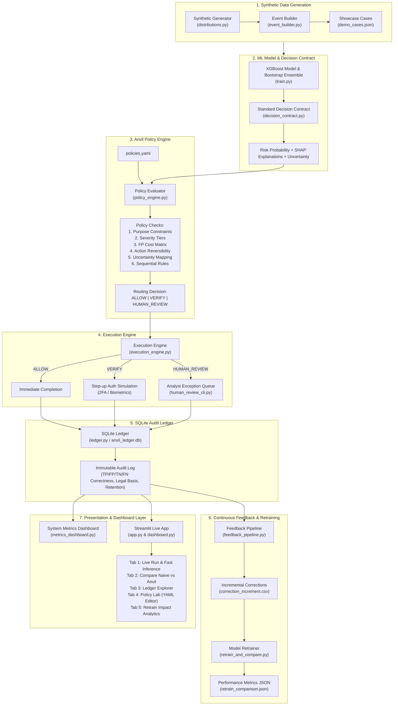

# Anvil: Policy-as-Code Payment Fraud Routing & Governance Engine
## End-to-End Technical Workflow & System Architecture

Anvil is a policy-governed payment fraud detection and routing platform. It bridges raw machine learning predictions with business policy rules, explainability signals, dynamic step-up verification, immutable audit logging, continuous feedback loops, and automated model retraining.

---

## 1. Core Objective & Problem Statement

Traditional machine learning (ML) models output a single fraud score or binary prediction (`ALLOW` vs `BLOCK`). In high-volume payment processing, hard blocking transactions based solely on probability thresholds leads to **high False Positive Rates (FPR)**, alienating legitimate customers and destroying gross merchandise value (GMV).

**Anvil solves this by decoupling raw ML scores from execution actions**:
1. **Decision Contracts**: Encapsulate risk probability, SHAP signal attribution, model uncertainty (bootstrap variance), and data provenance.
2. **Policy-as-Code Engine (`policies.yaml`)**: Applies business governance (customer tenure FP cost, transaction severity, action reversibility, legal purpose constraints) to route transactions dynamically into `ALLOW`, `VERIFY` (step-up authentication), or `HUMAN_REVIEW`.
3. **Execution Engine**: Simulates step-up authentication (2FA/biometric) and analyst exception management to recover legitimate transactions before blocking.
4. **SQLite Audit Ledger**: Maintains immutable compliance trails, legal provenance tags (`cross_merchant_derived`), and financial retention metrics.
5. **Continuous Feedback Loop**: Extracts false positive/negative cases from the ledger to generate incremental training datasets (`correction_increment.csv`), retrain the ML model, and benchmark performance improvements.

---

## 2. Technology Stack

| Layer | Component | Technology / Tooling |
| :--- | :--- | :--- |
| **Language & Core** | Runtime Environment | Python 3.10+ |
| **Machine Learning** | Model Training & Inference | XGBoost, Scikit-learn (`XGBClassifier`, `RandomForestClassifier`) |
| **Explainability & Uncertainty** | Model Interpretability | SHAP (TreeExplainer), Bootstrap Ensemble Variance |
| **Data Processing & Math** | Signal Engineering | Pandas, NumPy, SciPy |
| **Policy Engine** | Policy-as-Code | PyYAML, Python Dynamic Expression Evaluator |
| **Audit & Storage** | Persistence & Audit Ledger | SQLite 3 (`anvil_ledger.db`), CSV, JSON |
| **Visual User Interfaces** | Web Applications & Analytics | Streamlit, Plotly, HTML/CSS |
| **CLI & Terminal Tools** | Analyst Console | Rich CLI, Argparse |
| **Testing & Quality** | Test Framework | Pytest |

---

## 3. End-to-End System Architecture Diagram



---

## 4. Detailed Component-by-Component Implementation

### 4.1 Synthetic Event Generator (`src/anvil/generator/`)
- **[distributions.py](file:///d:/razorpay/src/anvil/generator/distributions.py)**: Defines statistical category distributions (`normal`, `suspicious`, `borderline`, `fraud`, `legitimate_but_unusual`, `merchant_anomaly`) and log-normal transaction amount samplers.
- **[event_builder.py](file:///d:/razorpay/src/anvil/generator/event_builder.py)**: Synthesizes multi-feature payment vectors containing:
  - `amount`, `device_novelty`, `transaction_velocity`, `location_deviation`, `merchant_history_score`, `customer_tenure_days`, `payment_method`, `ip_reputation_score`, `ground_truth_label`.
- **[showcase.py](file:///d:/razorpay/src/anvil/generator/showcase.py)**: Generates 8 deterministic showcase demo vectors (`demo_cases.json`) representing classic edge cases (e.g. ₹45,000 high-amount purchase by a 400-day tenured customer with device novelty).

### 4.2 Machine Learning Model & Decision Contract (`src/anvil/models/`)
- **[train.py](file:///d:/razorpay/src/anvil/models/train.py)**: Trains the primary XGBoost classifier alongside a 5-model bootstrap ensemble to estimate prediction variance. Saves artifacts to `models/xgb_model.pkl` and `models/ensemble/`.
- **[decision_contract.py](file:///d:/razorpay/src/anvil/models/decision_contract.py)**: Builds a standardized JSON payload for each transaction:
  ```json
  {
    "transaction_id": "tx_showcase_001",
    "risk_probability": 0.82,
    "prediction_uncertainty": {"std_dev": 0.03, "confidence": "high"},
    "naive_recommended_action": "BLOCK",
    "top_contributing_signals": [
      {"feature": "amount", "contribution": 0.35},
      {"feature": "device_novelty", "contribution": 0.28}
    ]
  }
  ```

### 4.3 Policy Engine (`src/anvil/policy_engine.py` & `policies.yaml`)
The policy engine evaluates decision contracts against `policies.yaml` through six sequential governance phases:
1. **Purpose Constraints**: Checks if cross-merchant signals (`merchant_history_score`) were derived under restricted tags (`cross_merchant_derived`). If present, enforces minimum action `VERIFY` and prohibits auto-`BLOCK`.
2. **Severity Mapping**: Maps transaction amounts to severity tiers (`low` <= ₹1,000, `medium` <= ₹10,000, `high` > ₹10,000).
3. **False Positive Cost Matrix**: Computes FP impact based on customer tenure:
   - Tenure > 365 days ("long") + High severity = `high` FP cost.
4. **Action Reversibility**: Evaluates if the proposed naive action can be reversed (e.g., `BLOCK`/`REVIEW` are reversible; `PERMANENT_SUSPEND` is irreversible).
5. **Uncertainty Calibration**: Combines standard deviation and distance from 0.5 decision boundary to classify model confidence (`low`, `medium`, `high`).
6. **Decision Rules Evaluation**: Evaluates top-to-bottom routing rules:
   - **Rule 1**: High FP cost + Reversible + Not High Confidence $\rightarrow$ `VERIFY` (saves legitimate revenue via step-up).
   - **Rule 2**: High FP cost + Reversible + High Confidence $\rightarrow$ `HUMAN_REVIEW`.
   - **Rule 3**: Naive `BLOCK` + non-high FP cost $\rightarrow$ `HUMAN_REVIEW`.
   - **Rule 4**: Purpose Constraint Triggered $\rightarrow$ `VERIFY`.
   - **Rule 5**: Irreversible Action $\rightarrow$ `HUMAN_REVIEW`.
   - **Rule 6**: Borderline Risk ($\ge 0.30$) $\rightarrow$ `HUMAN_REVIEW`.
   - **Rule 7**: Default Fallback $\rightarrow$ `ALLOW`.

### 4.4 Real-time Execution Engine (`src/anvil/execution_engine.py`)
Executes policy routing decisions:
- `ALLOW`: Completes transaction immediately (`final_outcome: "completed"`).
- `VERIFY`: Triggers step-up authentication (2FA/biometric). If verification passes, `final_outcome: "completed"` (recovering a false positive!); if it fails, `final_outcome: "blocked"`.
- `HUMAN_REVIEW`: Queues for analyst review. Integrates with [human_review_cli.py](file:///d:/razorpay/human_review_cli.py) for live overrides.

### 4.5 SQLite Audit Ledger (`src/anvil/ledger.py`)
Persists immutable records into `anvil_ledger.db` (`ledger` table). Automatically computes:
- **Audit Correctness**: `TP` (True Positive), `FP` (False Positive), `TN` (True Negative), `FN` (False Negative).
- **Legal Provenance Tag**: `cross_merchant_derived` vs `own_history`.
- **Financial Retention Class**: `financial_record_required` (7 years) vs `short_term_ops` (90 days).

### 4.6 Feedback Pipeline & Retraining Loop
- **[feedback_pipeline.py](file:///d:/razorpay/feedback_pipeline.py)**: Scans ledger records where execution outcomes revealed ground-truth mismatches (e.g. `VERIFY` completed on a naive `BLOCK` case). Generates `correction_increment.csv`.
- **[retrain_and_compare.py](file:///d:/razorpay/retrain_and_compare.py)**: Retrains the primary XGBoost model on `events.csv + correction_increment.csv`, evaluates on a held-out benchmark set, and generates side-by-side metric deltas (`retrain_comparison.json`).

### 4.7 Metrics Dashboard & Visual Interfaces
- **[metrics_dashboard.py](file:///d:/razorpay/metrics_dashboard.py)**: CLI metric summary reporting routing distribution, false positives prevented, and Naive vs Anvil performance matrices.
- **[app.py](file:///d:/razorpay/app.py)** & **[dashboard.py](file:///d:/razorpay/dashboard.py)**: Full Streamlit Web Applications offering:
  - Live single/batch transaction execution.
  - Interactive policy configuration editor (`policies.yaml`).
  - SQLite Ledger Explorer & filterable audit log.
  - Retrain impact benchmarking & Plotly charts.

---

## 5. End-to-End Execution Example

When a ₹45,000 transaction for a 400-day customer with high device novelty is processed:
1. **Raw ML Model**: Computes 82.0% fraud risk $\rightarrow$ Naive action: `BLOCK`.
2. **Policy Engine**: Detects `fp_cost = 'high'`, `is_reversible = True`, and routes to **`VERIFY`** instead of auto-blocking.
3. **Execution Engine**: Prompts step-up 2FA authentication. Customer enters OTP successfully $\rightarrow$ Payment completes!
4. **Ledger Record**: Logs `correctness = "TN"` (False Positive Prevented), saving a ₹45,000 sale.
5. **Feedback Loop**: Records successful completion in `correction_increment.csv` to refine the model's future threshold on tenured customers.

---

## 6. How to Run the Project

1. **Run End-to-End Terminal Pipeline Demo**:
   ```bash
   python run_pipeline.py
   ```

2. **Run System Metrics Dashboard**:
   ```bash
   python metrics_dashboard.py
   ```

3. **Run Feedback Pipeline & Model Retraining**:
   ```bash
   python feedback_pipeline.py
   python retrain_and_compare.py
   ```

4. **Launch Web Streamlit Dashboard**:
   ```bash
   streamlit run dashboard.py
   ```

5. **Execute Pytest Test Suite**:
   ```bash
   python -m pytest tests/
   ```
